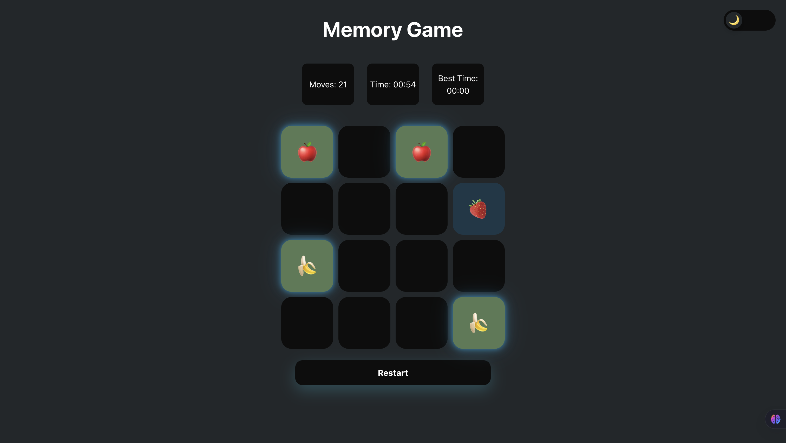
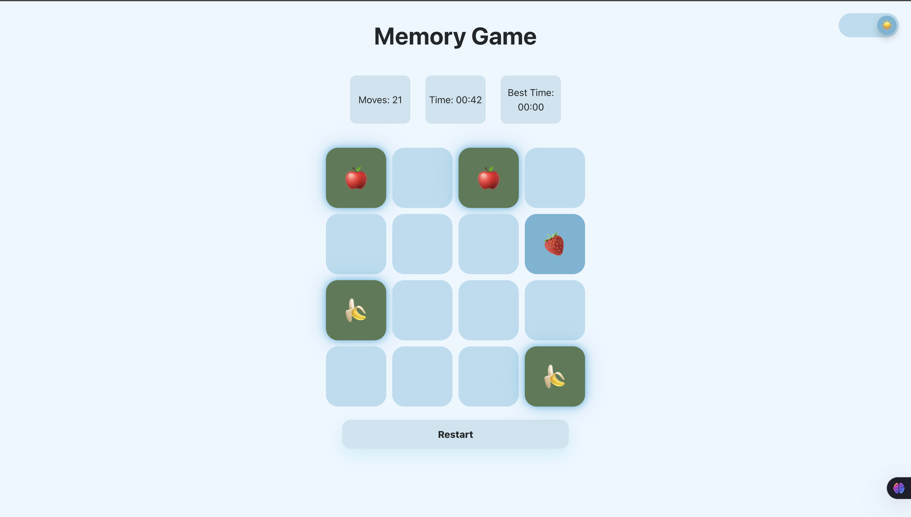

# Memory Game

A simple and fun memory matching game built with React.

## Features

- Flip cards to find matching pairs
- Tracks moves and time taken
- Responsive design for desktop and mobile
- Restart option to play again

## How to Play

1. Click on a card to flip it.
2. Flip another card to find its match.
3. If the cards match, they stay flipped.
4. If not, they flip back over.
5. Match all pairs to win the game!

## Installation

1. Clone the repository:
    ```bash
    git clone https://github.com/yourusername/memory-game.git
    ```
2. Install dependencies:
    ```bash
    npm install
    ```
3. Start the development server:
    ```bash
    npm run dev
    ```
4. Open [http://localhost:5173](http://localhost:5173) in your browser.

## Technologies Used

- React
- HTML
- CSS
- JavaScript

## Screenshots
### Dark Theme

### Light Theme


